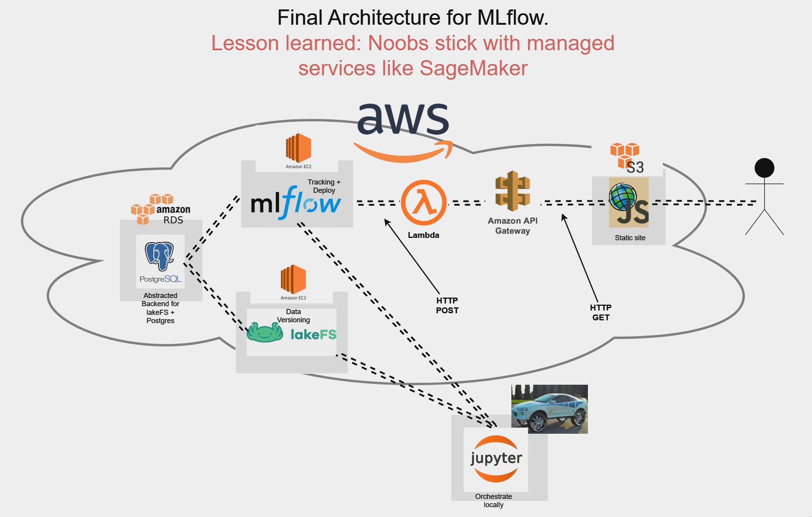

# MLOps Project: Scikit-learn / MLflow Country Predictor

Check it out [here!](https://ryans-website-thing-public.s3.us-west-2.amazonaws.com/countries_gaussian_nb.html)

Thanks for having a look at my project! Any way I took the Intel MLOps course, got familiar with things like data versioning and MLFlow and decided to do a project with it on AWS. 
lakeFS is a git like repository for data. MLFlow is a machine learning model repository and deployment pipeline. This makes dealing with multiple models floating around much easier to swap out. ArcGIS JS is a map front end that queries the MLFlow endpoint and spits out the model prediction in a clicky mappy sort of way that's fun to play with. 
I was going to use MLFlow to deploy SageMaker endpoints so that I would not need to pay for idle EC2 instances, but that functionality is bugged as of 12/23. If that were working, model and front end deployment would be automated as part of MLOps best practices. 

Currently working on moving this from semi-managed infrastructure over to SageMaker.

Feel free to rip this off - as long as you learn something. Contact me on linkedin!
